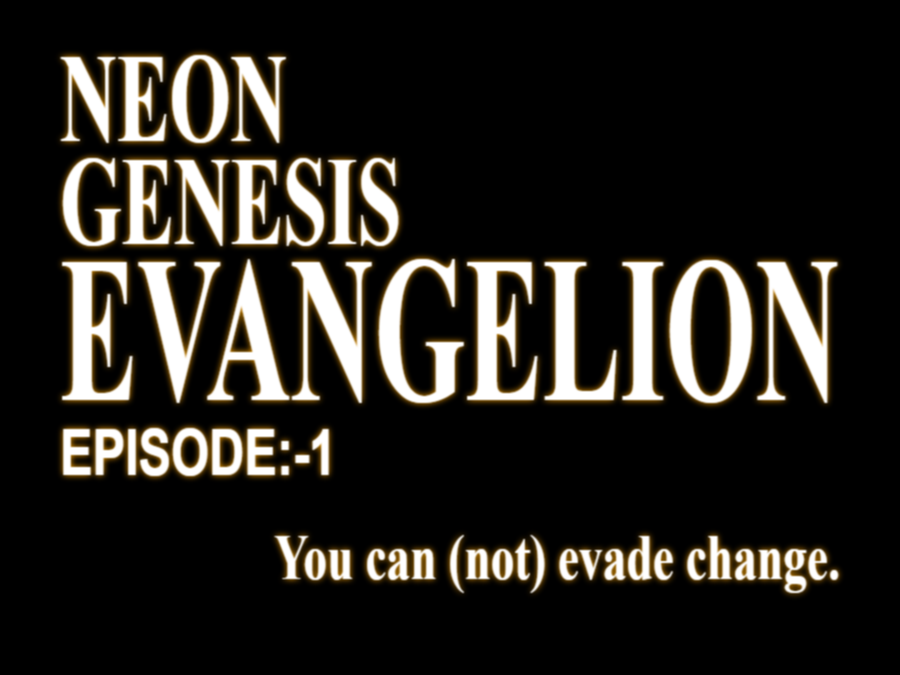

# NERV Confidential Report

> **"神は天にいまし、すべて世は事もなし。"**  
> *God is in His Heaven. All's right with the world.*

## Mission Statement

We at **NERV** exist for two primary reasons:

1. **Protect Humanity (人類保護)**  
  Our Evangelion units stand as the last defense against the *Angels*.  
  Every operation, every life risked, serves this singular goal.  

2. **Generate Profit (利益確保)**  
  Defense requires funding.  
  Funding requires innovation, exclusivity, and *control*.  
  To protect the world, we must own the tools that make protection possible.  

## Internal Directives

- **Secrecy (機密):** All project data classified as *Level 7* or above.
- **Pilot Management:** Children are assets, not expendables... *officially*.
- **Technology Monopoly:** EVA schematics remain *top secret*.

## Closing Statement

> *"We protect to profit, and profit to protect."*

That is why **NERV** exists.

**Acting Commander**  
碇 ゲンドウ

